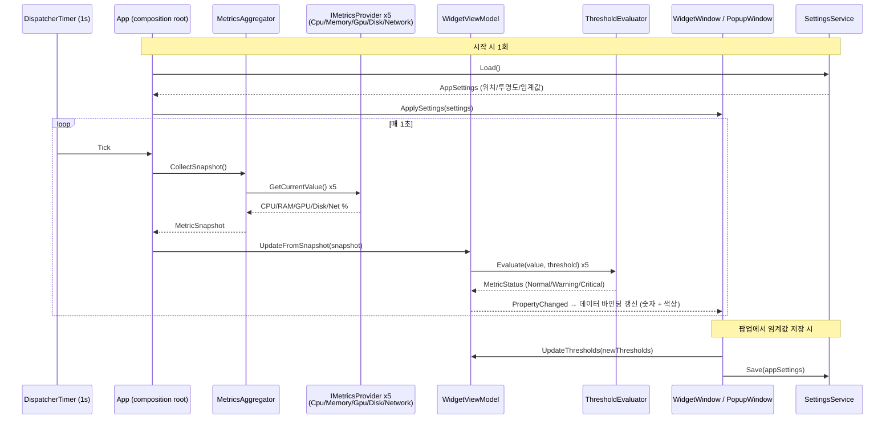

# SysMonWidget Implementation Plan

> **For agentic workers:** REQUIRED SUB-SKILL: Use superpowers:subagent-driven-development (recommended) or superpowers:executing-plans to implement this plan task-by-task. Steps use checkbox (`- [ ]`) syntax for tracking.

**Goal:** Windows에서 CPU/메모리/GPU/디스크/네트워크를 실시간으로 보여주는 항상-위(Always-on-top) 미니 위젯 + 팝업 확장 뷰 앱을 만든다.

**Architecture:** WPF(.NET 8) 앱. 1초 주기 타이머가 `MetricsAggregator`를 깨우면 5개 `IMetricsProvider`가 Windows 성능 카운터를 읽어 스냅샷을 만들고, `ThresholdEvaluator`가 각 지표를 정상/경고/위험으로 판정한 뒤 `WidgetViewModel`이 바인딩 상태로 변환해 `WidgetWindow`/`PopupWindow`에 반영된다. 설정은 `SettingsService`가 JSON으로 영속화하고, `StartupRegistrationService`가 레지스트리로 자동 실행을 등록한다.



**Tech Stack:** C# / .NET 8 / WPF, `System.Diagnostics.PerformanceCounter` NuGet 패키지, `Microsoft.Win32.Registry`, xUnit(테스트), `System.Text.Json`.

## Global Constraints

- 대상 플랫폼은 Windows 전용(WPF, `net8.0-windows`). 이 계획의 빌드/실행/수동검증은 Windows 환경에서 진행한다.
- 성능 카운터 수집 주기는 기본 1초.
- GPU 사용률은 Windows 10+ 내장 "GPU Engine" 성능 카운터 카테고리 사용(벤더별 SDK 금지).
- 디스크/네트워크는 절대치가 아닌 "링크/용량 대비 사용률 %"로 정규화한다.
- 임계값 기본값: CPU 70/90, 메모리 80/90, GPU 80/90, 디스크 70/90, 네트워크 70/90 (경고/위험, % 단위).
- 위젯은 `Topmost=true`, `ShowInTaskbar=false`로 항상-위·작업표시줄 미노출.
- 설정 파일 경로: `%AppData%\SysMonWidget\settings.json`.
- 자동 실행은 `HKCU\Software\Microsoft\Windows\CurrentVersion\Run` 등록 방식(관리자 권한 불필요).
- 위젯 자체 리소스 목표: CPU 1% 미만, 메모리 수십 MB 이내.
- 커밋 메시지는 `type(scope): description` 컨벤션(feat/fix/refactor/test/chore 등)을 따른다. **커밋은 각 Step에 적혀 있어도 사용자 승인 없이 자동 실행하지 않는다** (CLAUDE.md 정책) — 실행자는 각 Task 완료 후 사용자에게 커밋 여부를 확인한다.

---

## 우선순위 개요

| 우선순위 | 의미 | 포함 Task |
|---|---|---|
| **P0** | 없으면 제품이 성립하지 않는 핵심 | 1~9 |
| **P1** | 있어야 PRD 성공 기준을 만족 | 10~12 |
| **P2** | 편의 기능, 나중에 추가해도 무방 | 13~15 |

---

## Phase 1 (P0): 프로젝트 뼈대 + 핵심 로직

### Task 1: 프로젝트 스캐폴딩

**Priority:** P0

**Files:**
- Create: `SysMonWidget.sln`
- Create: `src/SysMonWidget/SysMonWidget.csproj`
- Create: `src/SysMonWidget/App.xaml`, `src/SysMonWidget/App.xaml.cs`
- Create: `tests/SysMonWidget.Tests/SysMonWidget.Tests.csproj`

**Interfaces:**
- Produces: 빌드 가능한 빈 WPF 프로젝트 + xUnit 테스트 프로젝트, 솔루션에 둘 다 등록됨.

- [ ] **Step 1: git 저장소 초기화**

```bash
git init
```

- [ ] **Step 2: WPF 프로젝트 생성**

```bash
dotnet new wpf -o src/SysMonWidget -n SysMonWidget --framework net8.0-windows
```

- [ ] **Step 3: 테스트 프로젝트 생성**

```bash
dotnet new xunit -o tests/SysMonWidget.Tests -n SysMonWidget.Tests --framework net8.0
```

- [ ] **Step 4: 솔루션 생성 및 프로젝트 연결**

```bash
dotnet new sln -n SysMonWidget
dotnet sln add src/SysMonWidget/SysMonWidget.csproj
dotnet sln add tests/SysMonWidget.Tests/SysMonWidget.Tests.csproj
dotnet add tests/SysMonWidget.Tests reference src/SysMonWidget
```

- [ ] **Step 5: 성능 카운터 NuGet 패키지 추가**

```bash
dotnet add src/SysMonWidget package System.Diagnostics.PerformanceCounter
```

- [ ] **Step 6: 빌드 확인**

Run: `dotnet build`
Expected: `Build succeeded. 0 Warning(s) 0 Error(s)` (템플릿 기본 코드만 있는 상태)

- [ ] **Step 7: 테스트 실행 확인**

Run: `dotnet test`
Expected: 템플릿이 만든 기본 테스트 1개가 PASS

- [ ] **Step 8: .gitignore 추가 후 커밋**

`.gitignore`:
```
bin/
obj/
*.user
```

```bash
git add .
git commit -m "chore(scaffold): initialize WPF app and test project"
```

---

### Task 2: 데이터 모델 정의

**Priority:** P0

**Files:**
- Create: `src/SysMonWidget/Models/MetricSnapshot.cs`
- Create: `src/SysMonWidget/Models/ThresholdSettings.cs`
- Create: `src/SysMonWidget/Models/AppSettings.cs`

**Interfaces:**
- Produces: `MetricSnapshot` record, `MetricThreshold`/`ThresholdSettings`/`MetricStatus`, `AppSettings` — 이후 모든 Task가 이 타입을 사용.

- [ ] **Step 1: MetricSnapshot 작성**

`src/SysMonWidget/Models/MetricSnapshot.cs`:
```csharp
namespace SysMonWidget.Models;

public record MetricSnapshot(
    double CpuUsagePercent,
    double MemoryUsagePercent,
    double GpuUsagePercent,
    double DiskActiveTimePercent,
    double NetworkUtilizationPercent,
    DateTime Timestamp);
```

- [ ] **Step 2: ThresholdSettings / MetricStatus 작성**

`src/SysMonWidget/Models/ThresholdSettings.cs`:
```csharp
namespace SysMonWidget.Models;

public class MetricThreshold
{
    public double WarningPercent { get; set; }
    public double CriticalPercent { get; set; }
}

public class ThresholdSettings
{
    public MetricThreshold Cpu { get; set; } = new() { WarningPercent = 70, CriticalPercent = 90 };
    public MetricThreshold Memory { get; set; } = new() { WarningPercent = 80, CriticalPercent = 90 };
    public MetricThreshold Gpu { get; set; } = new() { WarningPercent = 80, CriticalPercent = 90 };
    public MetricThreshold Disk { get; set; } = new() { WarningPercent = 70, CriticalPercent = 90 };
    public MetricThreshold Network { get; set; } = new() { WarningPercent = 70, CriticalPercent = 90 };
}

public enum MetricStatus
{
    Normal,
    Warning,
    Critical
}
```

- [ ] **Step 3: AppSettings 작성**

`src/SysMonWidget/Models/AppSettings.cs`:
```csharp
namespace SysMonWidget.Models;

public class AppSettings
{
    public double WindowLeft { get; set; } = 100;
    public double WindowTop { get; set; } = 100;
    public double Opacity { get; set; } = 0.85;
    public bool RunAtStartup { get; set; } = false;
    public ThresholdSettings Thresholds { get; set; } = new();
}
```

- [ ] **Step 4: 빌드 확인**

Run: `dotnet build`
Expected: 성공

- [ ] **Step 5: 커밋**

```bash
git add src/SysMonWidget/Models
git commit -m "feat(models): add metric snapshot, threshold, and app settings models"
```

---

### Task 3: ThresholdEvaluator (경고/위험 판정 로직)

**Priority:** P0

**Files:**
- Create: `src/SysMonWidget/Services/ThresholdEvaluator.cs`
- Test: `tests/SysMonWidget.Tests/ThresholdEvaluatorTests.cs`

**Interfaces:**
- Consumes: `MetricThreshold` (Task 2)
- Produces: `ThresholdEvaluator.Evaluate(double value, MetricThreshold threshold) : MetricStatus` — Task 8(WidgetViewModel)에서 사용.

- [ ] **Step 1: 실패하는 테스트 작성**

`tests/SysMonWidget.Tests/ThresholdEvaluatorTests.cs`:
```csharp
using SysMonWidget.Models;
using SysMonWidget.Services;
using Xunit;

namespace SysMonWidget.Tests;

public class ThresholdEvaluatorTests
{
    private readonly ThresholdEvaluator _sut = new();
    private readonly MetricThreshold _threshold = new() { WarningPercent = 70, CriticalPercent = 90 };

    [Fact]
    public void Evaluate_BelowWarning_ReturnsNormal()
    {
        var result = _sut.Evaluate(50, _threshold);
        Assert.Equal(MetricStatus.Normal, result);
    }

    [Fact]
    public void Evaluate_AtWarningThreshold_ReturnsWarning()
    {
        var result = _sut.Evaluate(70, _threshold);
        Assert.Equal(MetricStatus.Warning, result);
    }

    [Fact]
    public void Evaluate_BetweenWarningAndCritical_ReturnsWarning()
    {
        var result = _sut.Evaluate(85, _threshold);
        Assert.Equal(MetricStatus.Warning, result);
    }

    [Fact]
    public void Evaluate_AtCriticalThreshold_ReturnsCritical()
    {
        var result = _sut.Evaluate(90, _threshold);
        Assert.Equal(MetricStatus.Critical, result);
    }
}
```

- [ ] **Step 2: 테스트 실패 확인**

Run: `dotnet test --filter ThresholdEvaluatorTests`
Expected: FAIL (컴파일 에러 — `ThresholdEvaluator` 타입 없음)

- [ ] **Step 3: 최소 구현 작성**

`src/SysMonWidget/Services/ThresholdEvaluator.cs`:
```csharp
using SysMonWidget.Models;

namespace SysMonWidget.Services;

public class ThresholdEvaluator
{
    public MetricStatus Evaluate(double value, MetricThreshold threshold)
    {
        if (value >= threshold.CriticalPercent) return MetricStatus.Critical;
        if (value >= threshold.WarningPercent) return MetricStatus.Warning;
        return MetricStatus.Normal;
    }
}
```

- [ ] **Step 4: 테스트 통과 확인**

Run: `dotnet test --filter ThresholdEvaluatorTests`
Expected: PASS (4개 테스트 모두)

- [ ] **Step 5: 커밋**

```bash
git add src/SysMonWidget/Services/ThresholdEvaluator.cs tests/SysMonWidget.Tests/ThresholdEvaluatorTests.cs
git commit -m "feat(services): add threshold evaluator for warning/critical status"
```

---

### Task 4: NetworkUtilizationCalculator (링크 대비 사용률 %)

**Priority:** P0

**Files:**
- Create: `src/SysMonWidget/Services/NetworkUtilizationCalculator.cs`
- Test: `tests/SysMonWidget.Tests/NetworkUtilizationCalculatorTests.cs`

**Interfaces:**
- Produces: `NetworkUtilizationCalculator.CalculatePercent(double bytesPerSecond, double linkSpeedBitsPerSecond) : double` — Task 6(NetworkMetricsProvider)에서 사용.

- [ ] **Step 1: 실패하는 테스트 작성**

`tests/SysMonWidget.Tests/NetworkUtilizationCalculatorTests.cs`:
```csharp
using SysMonWidget.Services;
using Xunit;

namespace SysMonWidget.Tests;

public class NetworkUtilizationCalculatorTests
{
    [Fact]
    public void CalculatePercent_HalfOfLinkSpeed_Returns50()
    {
        // 1000 Mbps 링크, 초당 62.5MB(=500Mbit) 전송 중
        var result = NetworkUtilizationCalculator.CalculatePercent(
            bytesPerSecond: 62_500_000, linkSpeedBitsPerSecond: 1_000_000_000);

        Assert.Equal(50, result, precision: 1);
    }

    [Fact]
    public void CalculatePercent_ZeroLinkSpeed_ReturnsZero()
    {
        var result = NetworkUtilizationCalculator.CalculatePercent(1000, 0);
        Assert.Equal(0, result);
    }

    [Fact]
    public void CalculatePercent_ExceedsLinkSpeed_ClampsTo100()
    {
        var result = NetworkUtilizationCalculator.CalculatePercent(
            bytesPerSecond: 200_000_000, linkSpeedBitsPerSecond: 1_000_000_000);

        Assert.Equal(100, result);
    }
}
```

- [ ] **Step 2: 테스트 실패 확인**

Run: `dotnet test --filter NetworkUtilizationCalculatorTests`
Expected: FAIL (타입 없음)

- [ ] **Step 3: 최소 구현 작성**

`src/SysMonWidget/Services/NetworkUtilizationCalculator.cs`:
```csharp
namespace SysMonWidget.Services;

public static class NetworkUtilizationCalculator
{
    public static double CalculatePercent(double bytesPerSecond, double linkSpeedBitsPerSecond)
    {
        if (linkSpeedBitsPerSecond <= 0) return 0;

        var bitsPerSecond = bytesPerSecond * 8;
        var percent = bitsPerSecond / linkSpeedBitsPerSecond * 100;
        return Math.Clamp(percent, 0, 100);
    }
}
```

- [ ] **Step 4: 테스트 통과 확인**

Run: `dotnet test --filter NetworkUtilizationCalculatorTests`
Expected: PASS (3개 테스트 모두)

- [ ] **Step 5: 커밋**

```bash
git add src/SysMonWidget/Services/NetworkUtilizationCalculator.cs tests/SysMonWidget.Tests/NetworkUtilizationCalculatorTests.cs
git commit -m "feat(services): add network utilization percent calculator"
```

---

### Task 5: IMetricsProvider + CPU/메모리 프로바이더

**Priority:** P0

**Files:**
- Create: `src/SysMonWidget/Services/IMetricsProvider.cs`
- Create: `src/SysMonWidget/Services/CpuMetricsProvider.cs`
- Create: `src/SysMonWidget/Services/MemoryMetricsProvider.cs`

**Interfaces:**
- Produces: `IMetricsProvider.GetCurrentValue() : double` (0~100 정규화된 값). `CpuMetricsProvider`, `MemoryMetricsProvider`가 이를 구현. Task 7(MetricsAggregator)에서 사용.

> Windows 성능 카운터/`GlobalMemoryStatusEx`에 의존하므로 이 Task는 실제 하드웨어 검증이 필요해 자동 단위테스트 대상에서 제외하고, 수동 검증으로 대체한다.

- [ ] **Step 1: 공통 인터페이스 작성**

`src/SysMonWidget/Services/IMetricsProvider.cs`:
```csharp
namespace SysMonWidget.Services;

public interface IMetricsProvider
{
    double GetCurrentValue();
}
```

- [ ] **Step 2: CpuMetricsProvider 작성**

`src/SysMonWidget/Services/CpuMetricsProvider.cs`:
```csharp
using System.Diagnostics;

namespace SysMonWidget.Services;

public class CpuMetricsProvider : IMetricsProvider, IDisposable
{
    private readonly PerformanceCounter _counter = new("Processor", "% Processor Time", "_Total");

    public CpuMetricsProvider()
    {
        _counter.NextValue(); // 첫 호출은 항상 0 — 워밍업
    }

    public double GetCurrentValue() => Math.Clamp(_counter.NextValue(), 0, 100);

    public void Dispose() => _counter.Dispose();
}
```

- [ ] **Step 3: MemoryMetricsProvider 작성 (GlobalMemoryStatusEx P/Invoke)**

`src/SysMonWidget/Services/MemoryMetricsProvider.cs`:
```csharp
using System.Runtime.InteropServices;

namespace SysMonWidget.Services;

public class MemoryMetricsProvider : IMetricsProvider
{
    [StructLayout(LayoutKind.Sequential)]
    private struct MEMORYSTATUSEX
    {
        public uint dwLength;
        public uint dwMemoryLoad;
        public ulong ullTotalPhys;
        public ulong ullAvailPhys;
        public ulong ullTotalPageFile;
        public ulong ullAvailPageFile;
        public ulong ullTotalVirtual;
        public ulong ullAvailVirtual;
        public ulong ullAvailExtendedVirtual;
    }

    [DllImport("kernel32.dll", SetLastError = true)]
    [return: MarshalAs(UnmanagedType.Bool)]
    private static extern bool GlobalMemoryStatusEx(ref MEMORYSTATUSEX lpBuffer);

    public double GetCurrentValue()
    {
        var status = new MEMORYSTATUSEX { dwLength = (uint)Marshal.SizeOf<MEMORYSTATUSEX>() };

        if (!GlobalMemoryStatusEx(ref status))
        {
            throw new InvalidOperationException("GlobalMemoryStatusEx failed.");
        }

        return status.dwMemoryLoad; // 이미 0~100 사이의 "사용중 물리 메모리 비율"
    }
}
```

- [ ] **Step 4: 수동 검증용 임시 콘솔 출력 확인**

`src/SysMonWidget/App.xaml.cs`의 `OnStartup`에 임시로 아래 코드를 추가해 콘솔(디버그 출력)로 값이 정상 범위(0~100)인지 확인 후 제거한다.

```csharp
var cpu = new CpuMetricsProvider();
System.Threading.Thread.Sleep(1000);
Debug.WriteLine($"CPU: {cpu.GetCurrentValue():F1}%");
Debug.WriteLine($"Memory: {new MemoryMetricsProvider().GetCurrentValue():F1}%");
```

Run: `dotnet run --project src/SysMonWidget` 후 출력 창(Debug Output)에서 두 값이 0~100 사이 정상 수치로 출력되는지 확인. 확인 후 이 임시 코드는 제거한다.

- [ ] **Step 5: 커밋**

```bash
git add src/SysMonWidget/Services/IMetricsProvider.cs src/SysMonWidget/Services/CpuMetricsProvider.cs src/SysMonWidget/Services/MemoryMetricsProvider.cs
git commit -m "feat(services): add CPU and memory metrics providers"
```

---

### Task 6: GPU/디스크/네트워크 프로바이더

**Priority:** P0

**Files:**
- Create: `src/SysMonWidget/Services/GpuMetricsProvider.cs`
- Create: `src/SysMonWidget/Services/DiskMetricsProvider.cs`
- Create: `src/SysMonWidget/Services/NetworkMetricsProvider.cs`

**Interfaces:**
- Consumes: `NetworkUtilizationCalculator.CalculatePercent` (Task 4)
- Produces: `IMetricsProvider` 구현 3종 추가. Task 7에서 사용.

- [ ] **Step 1: GpuMetricsProvider 작성 (엔진 타입별 합산 후 최대값)**

`src/SysMonWidget/Services/GpuMetricsProvider.cs`:
```csharp
using System.Diagnostics;

namespace SysMonWidget.Services;

public class GpuMetricsProvider : IMetricsProvider
{
    private const string CategoryName = "GPU Engine";
    private const string CounterName = "Utilization Percentage";

    public double GetCurrentValue()
    {
        if (!PerformanceCounterCategory.Exists(CategoryName))
        {
            return 0;
        }

        var category = new PerformanceCounterCategory(CategoryName);
        var instanceNames = category.GetInstanceNames();
        var engineTotals = new Dictionary<string, double>();

        foreach (var instanceName in instanceNames)
        {
            using var counter = new PerformanceCounter(CategoryName, CounterName, instanceName, readOnly: true);
            counter.NextValue();
            Thread.Sleep(1);
            var value = counter.NextValue();

            var engineType = ExtractEngineType(instanceName);
            engineTotals.TryGetValue(engineType, out var current);
            engineTotals[engineType] = current + value;
        }

        return engineTotals.Count == 0 ? 0 : Math.Clamp(engineTotals.Values.Max(), 0, 100);
    }

    private static string ExtractEngineType(string instanceName)
    {
        var index = instanceName.IndexOf("engtype_", StringComparison.OrdinalIgnoreCase);
        return index >= 0 ? instanceName[index..] : instanceName;
    }
}
```

- [ ] **Step 2: DiskMetricsProvider 작성**

`src/SysMonWidget/Services/DiskMetricsProvider.cs`:
```csharp
using System.Diagnostics;

namespace SysMonWidget.Services;

public class DiskMetricsProvider : IMetricsProvider, IDisposable
{
    private readonly PerformanceCounter _counter = new("PhysicalDisk", "% Disk Time", "_Total");

    public DiskMetricsProvider()
    {
        _counter.NextValue();
    }

    public double GetCurrentValue() => Math.Clamp(_counter.NextValue(), 0, 100);

    public void Dispose() => _counter.Dispose();
}
```

- [ ] **Step 3: NetworkMetricsProvider 작성**

`src/SysMonWidget/Services/NetworkMetricsProvider.cs`:
```csharp
using System.Diagnostics;

namespace SysMonWidget.Services;

public class NetworkMetricsProvider : IMetricsProvider
{
    private const string CategoryName = "Network Interface";

    public double GetCurrentValue()
    {
        if (!PerformanceCounterCategory.Exists(CategoryName))
        {
            return 0;
        }

        var category = new PerformanceCounterCategory(CategoryName);
        var instanceNames = category.GetInstanceNames();

        double totalBytesPerSecond = 0;
        double totalBandwidthBits = 0;

        foreach (var instanceName in instanceNames)
        {
            using var bytesCounter = new PerformanceCounter(CategoryName, "Bytes Total/sec", instanceName, readOnly: true);
            using var bandwidthCounter = new PerformanceCounter(CategoryName, "Current Bandwidth", instanceName, readOnly: true);

            var bandwidth = bandwidthCounter.NextValue();
            if (bandwidth <= 0) continue; // 비활성 NIC 제외

            totalBytesPerSecond += bytesCounter.NextValue();
            totalBandwidthBits += bandwidth;
        }

        return NetworkUtilizationCalculator.CalculatePercent(totalBytesPerSecond, totalBandwidthBits);
    }
}
```

- [ ] **Step 4: 수동 검증**

Task 5의 Step 4처럼 `App.xaml.cs`에 임시 출력 코드를 추가해 `GpuMetricsProvider`, `DiskMetricsProvider`, `NetworkMetricsProvider` 값이 각각 0~100 사이로 출력되는지 확인 후 제거한다. 네트워크의 경우 파일 다운로드 등으로 부하를 주면서 값이 올라가는지 확인한다.

- [ ] **Step 5: 커밋**

```bash
git add src/SysMonWidget/Services/GpuMetricsProvider.cs src/SysMonWidget/Services/DiskMetricsProvider.cs src/SysMonWidget/Services/NetworkMetricsProvider.cs
git commit -m "feat(services): add GPU, disk, and network metrics providers"
```

---

### Task 7: MetricsAggregator

**Priority:** P0

**Files:**
- Create: `src/SysMonWidget/Services/MetricsAggregator.cs`
- Test: `tests/SysMonWidget.Tests/MetricsAggregatorTests.cs`

**Interfaces:**
- Consumes: `IMetricsProvider` (Task 5, 6)
- Produces: `MetricsAggregator.CollectSnapshot() : MetricSnapshot` — Task 8에서 사용.

- [ ] **Step 1: 실패하는 테스트 작성 (Fake Provider 사용)**

`tests/SysMonWidget.Tests/MetricsAggregatorTests.cs`:
```csharp
using SysMonWidget.Services;
using Xunit;

namespace SysMonWidget.Tests;

public class MetricsAggregatorTests
{
    private class FakeProvider : IMetricsProvider
    {
        private readonly double _value;
        public FakeProvider(double value) => _value = value;
        public double GetCurrentValue() => _value;
    }

    [Fact]
    public void CollectSnapshot_ReturnsValuesFromEachProvider()
    {
        var sut = new MetricsAggregator(
            cpu: new FakeProvider(10),
            memory: new FakeProvider(20),
            gpu: new FakeProvider(30),
            disk: new FakeProvider(40),
            network: new FakeProvider(50));

        var snapshot = sut.CollectSnapshot();

        Assert.Equal(10, snapshot.CpuUsagePercent);
        Assert.Equal(20, snapshot.MemoryUsagePercent);
        Assert.Equal(30, snapshot.GpuUsagePercent);
        Assert.Equal(40, snapshot.DiskActiveTimePercent);
        Assert.Equal(50, snapshot.NetworkUtilizationPercent);
    }
}
```

- [ ] **Step 2: 테스트 실패 확인**

Run: `dotnet test --filter MetricsAggregatorTests`
Expected: FAIL (타입 없음)

- [ ] **Step 3: 최소 구현 작성**

`src/SysMonWidget/Services/MetricsAggregator.cs`:
```csharp
using SysMonWidget.Models;

namespace SysMonWidget.Services;

public class MetricsAggregator
{
    private readonly IMetricsProvider _cpu;
    private readonly IMetricsProvider _memory;
    private readonly IMetricsProvider _gpu;
    private readonly IMetricsProvider _disk;
    private readonly IMetricsProvider _network;

    public MetricsAggregator(
        IMetricsProvider cpu,
        IMetricsProvider memory,
        IMetricsProvider gpu,
        IMetricsProvider disk,
        IMetricsProvider network)
    {
        _cpu = cpu;
        _memory = memory;
        _gpu = gpu;
        _disk = disk;
        _network = network;
    }

    public MetricSnapshot CollectSnapshot()
    {
        return new MetricSnapshot(
            _cpu.GetCurrentValue(),
            _memory.GetCurrentValue(),
            _gpu.GetCurrentValue(),
            _disk.GetCurrentValue(),
            _network.GetCurrentValue(),
            DateTime.Now);
    }
}
```

- [ ] **Step 4: 테스트 통과 확인**

Run: `dotnet test --filter MetricsAggregatorTests`
Expected: PASS

- [ ] **Step 5: 커밋**

```bash
git add src/SysMonWidget/Services/MetricsAggregator.cs tests/SysMonWidget.Tests/MetricsAggregatorTests.cs
git commit -m "feat(services): add metrics aggregator that collects a snapshot from all providers"
```

---

### Task 8: WidgetViewModel

**Priority:** P0

**Files:**
- Create: `src/SysMonWidget/ViewModels/WidgetViewModel.cs`
- Test: `tests/SysMonWidget.Tests/WidgetViewModelTests.cs`

**Interfaces:**
- Consumes: `ThresholdEvaluator.Evaluate` (Task 3), `MetricSnapshot`/`ThresholdSettings` (Task 2)
- Produces: `WidgetViewModel.UpdateFromSnapshot(MetricSnapshot)`, `UpdateThresholds(ThresholdSettings)`, 프로퍼티 `CpuUsagePercent/CpuStatus/MemoryUsagePercent/MemoryStatus/GpuUsagePercent/GpuStatus/DiskUsagePercent/DiskStatus/NetworkUsagePercent/NetworkStatus` — Task 9(WidgetWindow), Task 12(PopupWindow)에서 바인딩 대상으로 사용.

- [ ] **Step 1: 실패하는 테스트 작성**

`tests/SysMonWidget.Tests/WidgetViewModelTests.cs`:
```csharp
using SysMonWidget.Models;
using SysMonWidget.Services;
using SysMonWidget.ViewModels;
using Xunit;

namespace SysMonWidget.Tests;

public class WidgetViewModelTests
{
    [Fact]
    public void UpdateFromSnapshot_CpuAboveCritical_SetsCriticalStatus()
    {
        var sut = new WidgetViewModel(new ThresholdEvaluator(), new ThresholdSettings());
        var snapshot = new MetricSnapshot(95, 10, 10, 10, 10, DateTime.Now);

        sut.UpdateFromSnapshot(snapshot);

        Assert.Equal(MetricStatus.Critical, sut.CpuStatus);
        Assert.Equal(95, sut.CpuUsagePercent);
    }

    [Fact]
    public void UpdateFromSnapshot_AllBelowWarning_AllNormal()
    {
        var sut = new WidgetViewModel(new ThresholdEvaluator(), new ThresholdSettings());
        var snapshot = new MetricSnapshot(10, 10, 10, 10, 10, DateTime.Now);

        sut.UpdateFromSnapshot(snapshot);

        Assert.Equal(MetricStatus.Normal, sut.CpuStatus);
        Assert.Equal(MetricStatus.Normal, sut.MemoryStatus);
        Assert.Equal(MetricStatus.Normal, sut.GpuStatus);
        Assert.Equal(MetricStatus.Normal, sut.DiskStatus);
        Assert.Equal(MetricStatus.Normal, sut.NetworkStatus);
    }

    [Fact]
    public void UpdateFromSnapshot_RaisesPropertyChanged()
    {
        var sut = new WidgetViewModel(new ThresholdEvaluator(), new ThresholdSettings());
        var raised = false;
        sut.PropertyChanged += (_, _) => raised = true;

        sut.UpdateFromSnapshot(new MetricSnapshot(10, 10, 10, 10, 10, DateTime.Now));

        Assert.True(raised);
    }
}
```

- [ ] **Step 2: 테스트 실패 확인**

Run: `dotnet test --filter WidgetViewModelTests`
Expected: FAIL (타입 없음)

- [ ] **Step 3: 최소 구현 작성**

`src/SysMonWidget/ViewModels/WidgetViewModel.cs`:
```csharp
using System.ComponentModel;
using SysMonWidget.Models;
using SysMonWidget.Services;

namespace SysMonWidget.ViewModels;

public class WidgetViewModel : INotifyPropertyChanged
{
    private readonly ThresholdEvaluator _evaluator;
    private ThresholdSettings _thresholds;

    public event PropertyChangedEventHandler? PropertyChanged;

    public double CpuUsagePercent { get; private set; }
    public MetricStatus CpuStatus { get; private set; }
    public double MemoryUsagePercent { get; private set; }
    public MetricStatus MemoryStatus { get; private set; }
    public double GpuUsagePercent { get; private set; }
    public MetricStatus GpuStatus { get; private set; }
    public double DiskUsagePercent { get; private set; }
    public MetricStatus DiskStatus { get; private set; }
    public double NetworkUsagePercent { get; private set; }
    public MetricStatus NetworkStatus { get; private set; }

    public WidgetViewModel(ThresholdEvaluator evaluator, ThresholdSettings thresholds)
    {
        _evaluator = evaluator;
        _thresholds = thresholds;
    }

    public void UpdateThresholds(ThresholdSettings thresholds) => _thresholds = thresholds;

    public void UpdateFromSnapshot(MetricSnapshot snapshot)
    {
        CpuUsagePercent = snapshot.CpuUsagePercent;
        CpuStatus = _evaluator.Evaluate(snapshot.CpuUsagePercent, _thresholds.Cpu);

        MemoryUsagePercent = snapshot.MemoryUsagePercent;
        MemoryStatus = _evaluator.Evaluate(snapshot.MemoryUsagePercent, _thresholds.Memory);

        GpuUsagePercent = snapshot.GpuUsagePercent;
        GpuStatus = _evaluator.Evaluate(snapshot.GpuUsagePercent, _thresholds.Gpu);

        DiskUsagePercent = snapshot.DiskActiveTimePercent;
        DiskStatus = _evaluator.Evaluate(snapshot.DiskActiveTimePercent, _thresholds.Disk);

        NetworkUsagePercent = snapshot.NetworkUtilizationPercent;
        NetworkStatus = _evaluator.Evaluate(snapshot.NetworkUtilizationPercent, _thresholds.Network);

        PropertyChanged?.Invoke(this, new PropertyChangedEventArgs(null));
    }
}
```

- [ ] **Step 4: 테스트 통과 확인**

Run: `dotnet test --filter WidgetViewModelTests`
Expected: PASS (3개 테스트 모두)

- [ ] **Step 5: 커밋**

```bash
git add src/SysMonWidget/ViewModels/WidgetViewModel.cs tests/SysMonWidget.Tests/WidgetViewModelTests.cs
git commit -m "feat(viewmodels): add widget view model with per-metric threshold status"
```

---

### Task 9: WidgetWindow — 미니 위젯 UI

**Priority:** P0

**Files:**
- Create: `src/SysMonWidget/Converters/MetricStatusToBrushConverter.cs`
- Create: `src/SysMonWidget/Views/WidgetWindow.xaml`, `src/SysMonWidget/Views/WidgetWindow.xaml.cs`
- Modify: `src/SysMonWidget/App.xaml` (StartupUri 제거), `src/SysMonWidget/App.xaml.cs` (OnStartup에서 WidgetWindow 생성 + 1초 타이머 연결)

**Interfaces:**
- Consumes: `WidgetViewModel` (Task 8), `MetricsAggregator` (Task 7), 5개 `IMetricsProvider` 구현체 (Task 5, 6)
- Produces: 실행 시 화면에 표시되는 항상-위 미니 위젯. Task 12(PopupWindow)가 이 창의 토글 대상이 됨.

- [ ] **Step 1: MetricStatus → Brush 컨버터 작성**

`src/SysMonWidget/Converters/MetricStatusToBrushConverter.cs`:
```csharp
using System.Globalization;
using System.Windows.Data;
using System.Windows.Media;
using SysMonWidget.Models;

namespace SysMonWidget.Converters;

public class MetricStatusToBrushConverter : IValueConverter
{
    public object Convert(object value, Type targetType, object parameter, CultureInfo culture)
    {
        return (MetricStatus)value switch
        {
            MetricStatus.Critical => Brushes.Red,
            MetricStatus.Warning => Brushes.Gold,
            _ => Brushes.LightGreen,
        };
    }

    public object ConvertBack(object value, Type targetType, object parameter, CultureInfo culture)
        => throw new NotSupportedException();
}
```

- [ ] **Step 2: WidgetWindow.xaml 작성**

`src/SysMonWidget/Views/WidgetWindow.xaml`:
```xml
<Window x:Class="SysMonWidget.Views.WidgetWindow"
        xmlns="http://schemas.microsoft.com/winfx/2006/xaml/presentation"
        xmlns:x="http://schemas.microsoft.com/winfx/2006/xaml"
        xmlns:conv="clr-namespace:SysMonWidget.Converters"
        Title="SysMonWidget"
        WindowStyle="None"
        AllowsTransparency="True"
        Background="#1E1E1E"
        Topmost="True"
        ShowInTaskbar="False"
        ResizeMode="NoResize"
        SizeToContent="WidthAndHeight"
        MouseLeftButtonDown="Window_MouseLeftButtonDown"
        MouseRightButtonUp="Window_MouseRightButtonUp">
    <Window.Resources>
        <conv:MetricStatusToBrushConverter x:Key="StatusToBrush" />
    </Window.Resources>
    <Border Padding="10" CornerRadius="6" Background="#1E1E1E">
        <StackPanel>
            <TextBlock Text="{Binding CpuUsagePercent, StringFormat='CPU {0:F0}%'}"
                       Foreground="{Binding CpuStatus, Converter={StaticResource StatusToBrush}}" />
            <TextBlock Text="{Binding MemoryUsagePercent, StringFormat='RAM {0:F0}%'}"
                       Foreground="{Binding MemoryStatus, Converter={StaticResource StatusToBrush}}" />
            <TextBlock Text="{Binding GpuUsagePercent, StringFormat='GPU {0:F0}%'}"
                       Foreground="{Binding GpuStatus, Converter={StaticResource StatusToBrush}}" />
            <TextBlock Text="{Binding DiskUsagePercent, StringFormat='DISK {0:F0}%'}"
                       Foreground="{Binding DiskStatus, Converter={StaticResource StatusToBrush}}" />
            <TextBlock Text="{Binding NetworkUsagePercent, StringFormat='NET {0:F0}%'}"
                       Foreground="{Binding NetworkStatus, Converter={StaticResource StatusToBrush}}" />
        </StackPanel>
    </Border>
</Window>
```

- [ ] **Step 3: WidgetWindow.xaml.cs 작성 (드래그 이동, 좌클릭 팝업 토글)**

`src/SysMonWidget/Views/WidgetWindow.xaml.cs`:
```csharp
using System.Windows;
using System.Windows.Input;
using SysMonWidget.ViewModels;

namespace SysMonWidget.Views;

public partial class WidgetWindow : Window
{
    public event EventHandler? TogglePopupRequested;

    public WidgetWindow(WidgetViewModel viewModel)
    {
        InitializeComponent();
        DataContext = viewModel;
    }

    private void Window_MouseLeftButtonDown(object sender, MouseButtonEventArgs e)
    {
        if (e.ClickCount == 1)
        {
            DragMove();
        }
    }

    private void Window_MouseRightButtonUp(object sender, MouseButtonEventArgs e)
    {
        TogglePopupRequested?.Invoke(this, EventArgs.Empty);
    }
}
```

- [ ] **Step 4: App.xaml에서 StartupUri 제거**

`src/SysMonWidget/App.xaml`에서 `StartupUri="MainWindow.xaml"` 속성을 삭제한다 (코드에서 직접 창을 띄울 것이므로).

- [ ] **Step 5: App.xaml.cs에서 위젯 생성 + 1초 폴링 타이머 연결**

`src/SysMonWidget/App.xaml.cs`:
```csharp
using System.Windows;
using System.Windows.Threading;
using SysMonWidget.Models;
using SysMonWidget.Services;
using SysMonWidget.ViewModels;
using SysMonWidget.Views;

namespace SysMonWidget;

public partial class App : Application
{
    private DispatcherTimer? _timer;
    private MetricsAggregator? _aggregator;
    private WidgetViewModel? _viewModel;

    protected override void OnStartup(StartupEventArgs e)
    {
        base.OnStartup(e);

        var thresholds = new ThresholdSettings();
        _aggregator = new MetricsAggregator(
            cpu: new CpuMetricsProvider(),
            memory: new MemoryMetricsProvider(),
            gpu: new GpuMetricsProvider(),
            disk: new DiskMetricsProvider(),
            network: new NetworkMetricsProvider());

        _viewModel = new WidgetViewModel(new ThresholdEvaluator(), thresholds);

        var widgetWindow = new WidgetWindow(_viewModel);
        widgetWindow.Show();

        _timer = new DispatcherTimer { Interval = TimeSpan.FromSeconds(1) };
        _timer.Tick += (_, _) => _viewModel.UpdateFromSnapshot(_aggregator.CollectSnapshot());
        _timer.Start();
    }
}
```

- [ ] **Step 6: 빌드 및 실행 후 수동 검증**

Run: `dotnet run --project src/SysMonWidget`

확인 항목:
- 화면에 반투명 다크 배경의 작은 위젯이 항상 다른 창 위에 표시되는가
- 1초마다 숫자가 갱신되는가
- 작업표시줄에 앱 아이콘이 뜨지 않는가
- 왼쪽 버튼으로 드래그하면 위젯이 이동하는가
- 부하를 발생시키면(예: CPU 스트레스 도구 실행) 해당 지표 색상이 노랑/빨강으로 바뀌는가

- [ ] **Step 7: 커밋**

```bash
git add src/SysMonWidget/Converters src/SysMonWidget/Views src/SysMonWidget/App.xaml src/SysMonWidget/App.xaml.cs
git commit -m "feat(views): add always-on-top mini widget window with live metrics"
```

---

## Phase 2 (P1): 설정 영속화 + 팝업

### Task 10: SettingsService (JSON 저장/로드)

**Priority:** P1

**Files:**
- Create: `src/SysMonWidget/Services/SettingsService.cs`
- Test: `tests/SysMonWidget.Tests/SettingsServiceTests.cs`

**Interfaces:**
- Consumes: `AppSettings` (Task 2)
- Produces: `SettingsService.Load() : AppSettings`, `SettingsService.Save(AppSettings)` — Task 11, 12에서 사용.

- [ ] **Step 1: 실패하는 테스트 작성**

`tests/SysMonWidget.Tests/SettingsServiceTests.cs`:
```csharp
using SysMonWidget.Models;
using SysMonWidget.Services;
using Xunit;

namespace SysMonWidget.Tests;

public class SettingsServiceTests : IDisposable
{
    private readonly string _tempFile =
        Path.Combine(Path.GetTempPath(), $"sysmon-test-{Guid.NewGuid()}.json");

    [Fact]
    public void Load_WhenFileDoesNotExist_ReturnsDefaultSettings()
    {
        var sut = new SettingsService(_tempFile);

        var result = sut.Load();

        Assert.Equal(70, result.Thresholds.Cpu.WarningPercent);
    }

    [Fact]
    public void SaveThenLoad_RoundTripsValues()
    {
        var sut = new SettingsService(_tempFile);
        var settings = new AppSettings { WindowLeft = 250, Opacity = 0.5, RunAtStartup = true };

        sut.Save(settings);
        var loaded = sut.Load();

        Assert.Equal(250, loaded.WindowLeft);
        Assert.Equal(0.5, loaded.Opacity);
        Assert.True(loaded.RunAtStartup);
    }

    public void Dispose()
    {
        if (File.Exists(_tempFile)) File.Delete(_tempFile);
    }
}
```

- [ ] **Step 2: 테스트 실패 확인**

Run: `dotnet test --filter SettingsServiceTests`
Expected: FAIL (타입 없음)

- [ ] **Step 3: 최소 구현 작성**

`src/SysMonWidget/Services/SettingsService.cs`:
```csharp
using System.Text.Json;
using SysMonWidget.Models;

namespace SysMonWidget.Services;

public class SettingsService
{
    private readonly string _filePath;

    public SettingsService(string? filePath = null)
    {
        _filePath = filePath ?? Path.Combine(
            Environment.GetFolderPath(Environment.SpecialFolder.ApplicationData),
            "SysMonWidget", "settings.json");
    }

    public AppSettings Load()
    {
        if (!File.Exists(_filePath))
        {
            return new AppSettings();
        }

        var json = File.ReadAllText(_filePath);
        return JsonSerializer.Deserialize<AppSettings>(json) ?? new AppSettings();
    }

    public void Save(AppSettings settings)
    {
        var directory = Path.GetDirectoryName(_filePath)!;
        if (!string.IsNullOrEmpty(directory))
        {
            Directory.CreateDirectory(directory);
        }

        var json = JsonSerializer.Serialize(settings, new JsonSerializerOptions { WriteIndented = true });
        File.WriteAllText(_filePath, json);
    }
}
```

- [ ] **Step 4: 테스트 통과 확인**

Run: `dotnet test --filter SettingsServiceTests`
Expected: PASS (2개 테스트 모두)

- [ ] **Step 5: 커밋**

```bash
git add src/SysMonWidget/Services/SettingsService.cs tests/SysMonWidget.Tests/SettingsServiceTests.cs
git commit -m "feat(services): add JSON-backed settings load/save service"
```

---

### Task 11: 위젯 위치/투명도 저장 연동

**Priority:** P1

**Files:**
- Modify: `src/SysMonWidget/Views/WidgetWindow.xaml.cs` (창 닫힐 때 위치 저장, 생성 시 위치/투명도 복원)
- Modify: `src/SysMonWidget/App.xaml.cs` (`SettingsService` 로드 후 `WidgetWindow`/`ThresholdSettings`에 반영, 종료 시 저장)

**Interfaces:**
- Consumes: `SettingsService` (Task 10), `AppSettings` (Task 2)
- Produces: 재실행 시 마지막 위치·투명도·임계값이 복원되는 동작.

- [ ] **Step 1: WidgetWindow가 초기 위치/투명도를 생성자에서 받도록 수정**

`src/SysMonWidget/Views/WidgetWindow.xaml.cs`에 아래 메서드를 추가한다.

```csharp
public void ApplySettings(AppSettings settings)
{
    Left = settings.WindowLeft;
    Top = settings.WindowTop;
    Opacity = settings.Opacity;
}

public (double Left, double Top) CurrentPosition => (Left, Top);
```

(파일 상단에 `using SysMonWidget.Models;` 추가)

- [ ] **Step 2: App.xaml.cs에서 설정 로드/적용/저장 연결**

`src/SysMonWidget/App.xaml.cs`의 `OnStartup`을 아래와 같이 수정하고, `OnExit`을 추가한다.

```csharp
private SettingsService? _settingsService;
private AppSettings? _appSettings;
private WidgetWindow? _widgetWindow;

protected override void OnStartup(StartupEventArgs e)
{
    base.OnStartup(e);

    _settingsService = new SettingsService();
    _appSettings = _settingsService.Load();

    _aggregator = new MetricsAggregator(
        cpu: new CpuMetricsProvider(),
        memory: new MemoryMetricsProvider(),
        gpu: new GpuMetricsProvider(),
        disk: new DiskMetricsProvider(),
        network: new NetworkMetricsProvider());

    _viewModel = new WidgetViewModel(new ThresholdEvaluator(), _appSettings.Thresholds);

    _widgetWindow = new WidgetWindow(_viewModel);
    _widgetWindow.ApplySettings(_appSettings);
    _widgetWindow.Show();

    _timer = new DispatcherTimer { Interval = TimeSpan.FromSeconds(1) };
    _timer.Tick += (_, _) => _viewModel.UpdateFromSnapshot(_aggregator.CollectSnapshot());
    _timer.Start();
}

protected override void OnExit(ExitEventArgs e)
{
    if (_widgetWindow is not null && _appSettings is not null && _settingsService is not null)
    {
        _appSettings.WindowLeft = _widgetWindow.CurrentPosition.Left;
        _appSettings.WindowTop = _widgetWindow.CurrentPosition.Top;
        _appSettings.Opacity = _widgetWindow.Opacity;
        _settingsService.Save(_appSettings);
    }

    base.OnExit(e);
}
```

- [ ] **Step 3: 수동 검증**

Run: `dotnet run --project src/SysMonWidget`, 위젯을 화면 다른 위치로 드래그 후 종료(Alt+F4 또는 트레이 종료 — Task 13 이전이므로 작업관리자로 종료해도 무방). 재실행 시 마지막으로 이동한 위치에 위젯이 뜨는지 확인. `%AppData%\SysMonWidget\settings.json` 파일이 생성되고 좌표가 저장되어 있는지 확인.

- [ ] **Step 4: 커밋**

```bash
git add src/SysMonWidget/Views/WidgetWindow.xaml.cs src/SysMonWidget/App.xaml.cs
git commit -m "feat(app): persist and restore widget position and opacity"
```

---

### Task 12: PopupWindow — 확장 뷰 + 임계값 커스터마이즈

**Priority:** P1

**Files:**
- Create: `src/SysMonWidget/Views/PopupWindow.xaml`, `src/SysMonWidget/Views/PopupWindow.xaml.cs`
- Modify: `src/SysMonWidget/Views/WidgetWindow.xaml.cs` (이미 있는 `TogglePopupRequested` 이벤트 유지)
- Modify: `src/SysMonWidget/App.xaml.cs` (`TogglePopupRequested` 구독, 팝업 표시/숨김 및 임계값 저장)

**Interfaces:**
- Consumes: `WidgetViewModel` (Task 8), `ThresholdSettings` (Task 2), `SettingsService.Save` (Task 10)
- Produces: 우클릭 시 뜨는 확장 뷰. 저장 시 `WidgetViewModel.UpdateThresholds` 호출로 위젯에도 즉시 반영.

- [ ] **Step 1: PopupWindow.xaml 작성**

`src/SysMonWidget/Views/PopupWindow.xaml`:
```xml
<Window x:Class="SysMonWidget.Views.PopupWindow"
        xmlns="http://schemas.microsoft.com/winfx/2006/xaml/presentation"
        xmlns:x="http://schemas.microsoft.com/winfx/2006/xaml"
        xmlns:conv="clr-namespace:SysMonWidget.Converters"
        Title="SysMonWidget - 상세"
        Width="320" SizeToContent="Height"
        Topmost="True"
        WindowStartupLocation="CenterScreen">
    <Window.Resources>
        <conv:MetricStatusToBrushConverter x:Key="StatusToBrush" />
    </Window.Resources>
    <StackPanel Margin="12">
        <TextBlock Text="{Binding CpuUsagePercent, StringFormat='CPU 사용률: {0:F0}%'}"
                   Foreground="{Binding CpuStatus, Converter={StaticResource StatusToBrush}}" FontSize="16" />
        <TextBlock Text="{Binding MemoryUsagePercent, StringFormat='메모리 사용률: {0:F0}%'}"
                   Foreground="{Binding MemoryStatus, Converter={StaticResource StatusToBrush}}" FontSize="16" />
        <TextBlock Text="{Binding GpuUsagePercent, StringFormat='GPU 사용률: {0:F0}%'}"
                   Foreground="{Binding GpuStatus, Converter={StaticResource StatusToBrush}}" FontSize="16" />
        <TextBlock Text="{Binding DiskUsagePercent, StringFormat='디스크 사용률: {0:F0}%'}"
                   Foreground="{Binding DiskStatus, Converter={StaticResource StatusToBrush}}" FontSize="16" />
        <TextBlock Text="{Binding NetworkUsagePercent, StringFormat='네트워크 사용률: {0:F0}%'}"
                   Foreground="{Binding NetworkStatus, Converter={StaticResource StatusToBrush}}" FontSize="16" />

        <Separator Margin="0,10" />
        <TextBlock Text="경고 임계값 (%)" FontWeight="Bold" Margin="0,0,0,6" />

        <Grid Margin="0,2">
            <Grid.ColumnDefinitions>
                <ColumnDefinition Width="80" />
                <ColumnDefinition Width="*" />
                <ColumnDefinition Width="*" />
            </Grid.ColumnDefinitions>
            <TextBlock Text="CPU" VerticalAlignment="Center" />
            <TextBox x:Name="CpuWarningBox" Grid.Column="1" Margin="2" />
            <TextBox x:Name="CpuCriticalBox" Grid.Column="2" Margin="2" />
        </Grid>
        <Grid Margin="0,2">
            <Grid.ColumnDefinitions>
                <ColumnDefinition Width="80" />
                <ColumnDefinition Width="*" />
                <ColumnDefinition Width="*" />
            </Grid.ColumnDefinitions>
            <TextBlock Text="메모리" VerticalAlignment="Center" />
            <TextBox x:Name="MemoryWarningBox" Grid.Column="1" Margin="2" />
            <TextBox x:Name="MemoryCriticalBox" Grid.Column="2" Margin="2" />
        </Grid>
        <Grid Margin="0,2">
            <Grid.ColumnDefinitions>
                <ColumnDefinition Width="80" />
                <ColumnDefinition Width="*" />
                <ColumnDefinition Width="*" />
            </Grid.ColumnDefinitions>
            <TextBlock Text="GPU" VerticalAlignment="Center" />
            <TextBox x:Name="GpuWarningBox" Grid.Column="1" Margin="2" />
            <TextBox x:Name="GpuCriticalBox" Grid.Column="2" Margin="2" />
        </Grid>
        <Grid Margin="0,2">
            <Grid.ColumnDefinitions>
                <ColumnDefinition Width="80" />
                <ColumnDefinition Width="*" />
                <ColumnDefinition Width="*" />
            </Grid.ColumnDefinitions>
            <TextBlock Text="디스크" VerticalAlignment="Center" />
            <TextBox x:Name="DiskWarningBox" Grid.Column="1" Margin="2" />
            <TextBox x:Name="DiskCriticalBox" Grid.Column="2" Margin="2" />
        </Grid>
        <Grid Margin="0,2">
            <Grid.ColumnDefinitions>
                <ColumnDefinition Width="80" />
                <ColumnDefinition Width="*" />
                <ColumnDefinition Width="*" />
            </Grid.ColumnDefinitions>
            <TextBlock Text="네트워크" VerticalAlignment="Center" />
            <TextBox x:Name="NetworkWarningBox" Grid.Column="1" Margin="2" />
            <TextBox x:Name="NetworkCriticalBox" Grid.Column="2" Margin="2" />
        </Grid>

        <Button x:Name="SaveButton" Content="저장" Margin="0,10,0,0" Click="SaveButton_Click" />
    </StackPanel>
</Window>
```

- [ ] **Step 2: PopupWindow.xaml.cs 작성**

`src/SysMonWidget/Views/PopupWindow.xaml.cs`:
```csharp
using System.Windows;
using SysMonWidget.Models;
using SysMonWidget.ViewModels;

namespace SysMonWidget.Views;

public partial class PopupWindow : Window
{
    private readonly WidgetViewModel _viewModel;
    private readonly ThresholdSettings _thresholds;

    public event EventHandler<ThresholdSettings>? ThresholdsSaved;

    public PopupWindow(WidgetViewModel viewModel, ThresholdSettings thresholds)
    {
        InitializeComponent();
        DataContext = viewModel;
        _viewModel = viewModel;
        _thresholds = thresholds;

        CpuWarningBox.Text = thresholds.Cpu.WarningPercent.ToString();
        CpuCriticalBox.Text = thresholds.Cpu.CriticalPercent.ToString();
        MemoryWarningBox.Text = thresholds.Memory.WarningPercent.ToString();
        MemoryCriticalBox.Text = thresholds.Memory.CriticalPercent.ToString();
        GpuWarningBox.Text = thresholds.Gpu.WarningPercent.ToString();
        GpuCriticalBox.Text = thresholds.Gpu.CriticalPercent.ToString();
        DiskWarningBox.Text = thresholds.Disk.WarningPercent.ToString();
        DiskCriticalBox.Text = thresholds.Disk.CriticalPercent.ToString();
        NetworkWarningBox.Text = thresholds.Network.WarningPercent.ToString();
        NetworkCriticalBox.Text = thresholds.Network.CriticalPercent.ToString();
    }

    private void SaveButton_Click(object sender, RoutedEventArgs e)
    {
        _thresholds.Cpu.WarningPercent = double.Parse(CpuWarningBox.Text);
        _thresholds.Cpu.CriticalPercent = double.Parse(CpuCriticalBox.Text);
        _thresholds.Memory.WarningPercent = double.Parse(MemoryWarningBox.Text);
        _thresholds.Memory.CriticalPercent = double.Parse(MemoryCriticalBox.Text);
        _thresholds.Gpu.WarningPercent = double.Parse(GpuWarningBox.Text);
        _thresholds.Gpu.CriticalPercent = double.Parse(GpuCriticalBox.Text);
        _thresholds.Disk.WarningPercent = double.Parse(DiskWarningBox.Text);
        _thresholds.Disk.CriticalPercent = double.Parse(DiskCriticalBox.Text);
        _thresholds.Network.WarningPercent = double.Parse(NetworkWarningBox.Text);
        _thresholds.Network.CriticalPercent = double.Parse(NetworkCriticalBox.Text);

        _viewModel.UpdateThresholds(_thresholds);
        ThresholdsSaved?.Invoke(this, _thresholds);
    }
}
```

- [ ] **Step 3: App.xaml.cs에서 토글 연결 및 저장 시 설정 반영**

`OnStartup`에 아래 배선을 추가한다.

```csharp
_widgetWindow.TogglePopupRequested += (_, _) =>
{
    var popup = new PopupWindow(_viewModel!, _appSettings!.Thresholds);
    popup.ThresholdsSaved += (_, updatedThresholds) =>
    {
        _appSettings.Thresholds = updatedThresholds;
        _settingsService!.Save(_appSettings);
    };
    popup.Show();
};
```

- [ ] **Step 4: 수동 검증**

Run: `dotnet run --project src/SysMonWidget`. 위젯을 우클릭해 팝업이 뜨는지, 임계값을 수정 후 저장하면 위젯 색상 기준이 즉시 바뀌는지, 재실행 후에도 수정한 임계값이 유지되는지 확인한다.

- [ ] **Step 5: 커밋**

```bash
git add src/SysMonWidget/Views/PopupWindow.xaml src/SysMonWidget/Views/PopupWindow.xaml.cs src/SysMonWidget/App.xaml.cs
git commit -m "feat(views): add expanded popup view with threshold customization"
```

---

## Phase 3 (P2): 편의 기능 + 배포

### Task 13: 시스템 트레이 아이콘

**Priority:** P2

**Files:**
- Modify: `src/SysMonWidget/SysMonWidget.csproj` (`UseWindowsForms=true` 추가)
- Create: `src/SysMonWidget/Views/TrayIconManager.cs`
- Modify: `src/SysMonWidget/App.xaml.cs` (`TrayIconManager` 초기화, 좌클릭 시 위젯 표시/숨김, 우클릭 메뉴에 종료)

**Interfaces:**
- Consumes: `WidgetWindow` (Task 9)
- Produces: 트레이 아이콘 좌클릭 → 위젯 Show/Hide 토글, 컨텍스트 메뉴 "종료" 클릭 → `Application.Current.Shutdown()`.

- [ ] **Step 1: csproj에 WinForms 참조 추가**

`src/SysMonWidget/SysMonWidget.csproj`의 `<PropertyGroup>`에 추가:
```xml
<UseWindowsForms>true</UseWindowsForms>
```

- [ ] **Step 2: TrayIconManager 작성**

`src/SysMonWidget/Views/TrayIconManager.cs`:
```csharp
using System.Windows;
using System.Windows.Forms;
using Application = System.Windows.Application;

namespace SysMonWidget.Views;

public class TrayIconManager : IDisposable
{
    private readonly NotifyIcon _notifyIcon;
    private readonly Window _widgetWindow;

    public TrayIconManager(Window widgetWindow)
    {
        _widgetWindow = widgetWindow;

        var contextMenu = new ContextMenuStrip();
        contextMenu.Items.Add("종료", null, (_, _) => Application.Current.Shutdown());

        _notifyIcon = new NotifyIcon
        {
            Icon = System.Drawing.SystemIcons.Application,
            Visible = true,
            Text = "SysMonWidget",
            ContextMenuStrip = contextMenu,
        };

        _notifyIcon.MouseClick += (_, e) =>
        {
            if (e.Button == MouseButtons.Left)
            {
                _widgetWindow.Visibility = _widgetWindow.IsVisible ? Visibility.Hidden : Visibility.Visible;
            }
        };
    }

    public void Dispose() => _notifyIcon.Dispose();
}
```

- [ ] **Step 3: App.xaml.cs에 연결**

`OnStartup` 끝부분에 추가:
```csharp
_trayIconManager = new TrayIconManager(_widgetWindow);
```

필드 선언 추가: `private TrayIconManager? _trayIconManager;`

`OnExit`에서 정리:
```csharp
_trayIconManager?.Dispose();
```

- [ ] **Step 4: 수동 검증**

Run: `dotnet run --project src/SysMonWidget`. 트레이에 아이콘이 뜨는지, 좌클릭으로 위젯이 숨김/표시되는지, 우클릭 메뉴의 "종료"로 앱이 완전히 종료되는지 확인.

- [ ] **Step 5: 커밋**

```bash
git add src/SysMonWidget/SysMonWidget.csproj src/SysMonWidget/Views/TrayIconManager.cs src/SysMonWidget/App.xaml.cs
git commit -m "feat(views): add system tray icon with show/hide and exit"
```

---

### Task 14: Windows 시작 시 자동 실행

**Priority:** P2

**Files:**
- Create: `src/SysMonWidget/Services/StartupRegistrationService.cs`
- Modify: `src/SysMonWidget/Views/PopupWindow.xaml` (자동 실행 체크박스 추가)
- Modify: `src/SysMonWidget/Views/PopupWindow.xaml.cs` (체크박스 상태 반영/저장)

**Interfaces:**
- Produces: `StartupRegistrationService.SetEnabled(bool)`, `IsEnabled() : bool` — 레지스트리 Run 키 등록/해제.

> 레지스트리 API는 Windows 전용이라 단위테스트 대상에서 제외하고 수동 검증으로 대체한다.

- [ ] **Step 1: StartupRegistrationService 작성**

`src/SysMonWidget/Services/StartupRegistrationService.cs`:
```csharp
using Microsoft.Win32;

namespace SysMonWidget.Services;

public class StartupRegistrationService
{
    private const string RunKeyPath = @"Software\Microsoft\Windows\CurrentVersion\Run";
    private const string ValueName = "SysMonWidget";
    private readonly string _executablePath;

    public StartupRegistrationService(string executablePath)
    {
        _executablePath = executablePath;
    }

    public void SetEnabled(bool enabled)
    {
        using var key = Registry.CurrentUser.OpenSubKey(RunKeyPath, writable: true)
            ?? Registry.CurrentUser.CreateSubKey(RunKeyPath);

        if (enabled)
        {
            key!.SetValue(ValueName, $"\"{_executablePath}\"");
        }
        else
        {
            key!.DeleteValue(ValueName, throwOnMissingValue: false);
        }
    }

    public bool IsEnabled()
    {
        using var key = Registry.CurrentUser.OpenSubKey(RunKeyPath, writable: false);
        return key?.GetValue(ValueName) != null;
    }
}
```

- [ ] **Step 2: PopupWindow에 체크박스 추가**

`PopupWindow.xaml`의 `SaveButton` 위에 추가:
```xml
<CheckBox x:Name="RunAtStartupCheckBox" Content="Windows 시작 시 자동 실행" Margin="0,10,0,0" />
```

- [ ] **Step 3: PopupWindow.xaml.cs에서 초기 상태 반영 및 저장 시 등록/해제**

생성자에 추가:
```csharp
RunAtStartupCheckBox.IsChecked = new StartupRegistrationService(Environment.ProcessPath!).IsEnabled();
```

`SaveButton_Click`에 추가:
```csharp
new StartupRegistrationService(Environment.ProcessPath!)
    .SetEnabled(RunAtStartupCheckBox.IsChecked == true);
```

- [ ] **Step 4: 수동 검증**

Run: `dotnet run --project src/SysMonWidget`. 팝업에서 체크박스를 켜고 저장 → `regedit`으로 `HKCU\Software\Microsoft\Windows\CurrentVersion\Run`에 `SysMonWidget` 값이 생성됐는지 확인. 체크 해제 후 저장하면 값이 삭제되는지 확인. (개발 중 `dotnet run`은 실행 경로가 임시 빌드 경로이므로, 최종 검증은 Task 15의 `dotnet publish` 결과물로 다시 확인한다.)

- [ ] **Step 5: 커밋**

```bash
git add src/SysMonWidget/Services/StartupRegistrationService.cs src/SysMonWidget/Views/PopupWindow.xaml src/SysMonWidget/Views/PopupWindow.xaml.cs
git commit -m "feat(services): add Windows startup registration via registry Run key"
```

---

### Task 15: Self-contained 배포 설정

**Priority:** P2

**Files:**
- Modify: `src/SysMonWidget/SysMonWidget.csproj` (RuntimeIdentifier, SelfContained, PublishSingleFile 설정 추가)

**Interfaces:**
- Produces: `dotnet publish` 시 런타임 설치 없이 실행 가능한 단일 `SysMonWidget.exe`.

- [ ] **Step 1: csproj에 배포 설정 추가**

`src/SysMonWidget/SysMonWidget.csproj`의 `<PropertyGroup>`에 추가:
```xml
<RuntimeIdentifier>win-x64</RuntimeIdentifier>
<SelfContained>true</SelfContained>
<PublishSingleFile>true</PublishSingleFile>
<IncludeNativeLibrariesForSelfExtract>true</IncludeNativeLibrariesForSelfExtract>
```

- [ ] **Step 2: 퍼블리시 실행**

```bash
dotnet publish src/SysMonWidget -c Release
```

Expected: `src/SysMonWidget/bin/Release/net8.0-windows/win-x64/publish/SysMonWidget.exe` 단일 파일 생성

- [ ] **Step 3: 수동 검증**

퍼블리시된 `SysMonWidget.exe`를 .NET 런타임이 설치되지 않은 환경(또는 별도 폴더로 복사)에서 더블클릭 실행해 정상 동작하는지 확인. 이 exe 경로로 자동 실행(Task 14)을 다시 등록해 재부팅 후에도 실행되는지 최종 확인한다.

- [ ] **Step 4: 커밋**

```bash
git add src/SysMonWidget/SysMonWidget.csproj
git commit -m "build(publish): configure self-contained single-file publish for win-x64"
```

---

## 검증 (전체)

- [ ] `dotnet test` 전체 실행 시 모든 단위테스트 PASS (`ThresholdEvaluator`, `NetworkUtilizationCalculator`, `MetricsAggregator`, `WidgetViewModel`, `SettingsService`)
- [ ] `dotnet publish` 결과물이 PRD의 성공 기준(3초 이내 부하 인지, 재부팅 후 설정 유지)을 만족하는지 실제 Windows 환경에서 확인
- [ ] PRD.md의 "범위 제외" 항목(프로세스 랭킹, 원격 모니터링, click-through, 다국어)이 구현에 포함되지 않았는지 확인
